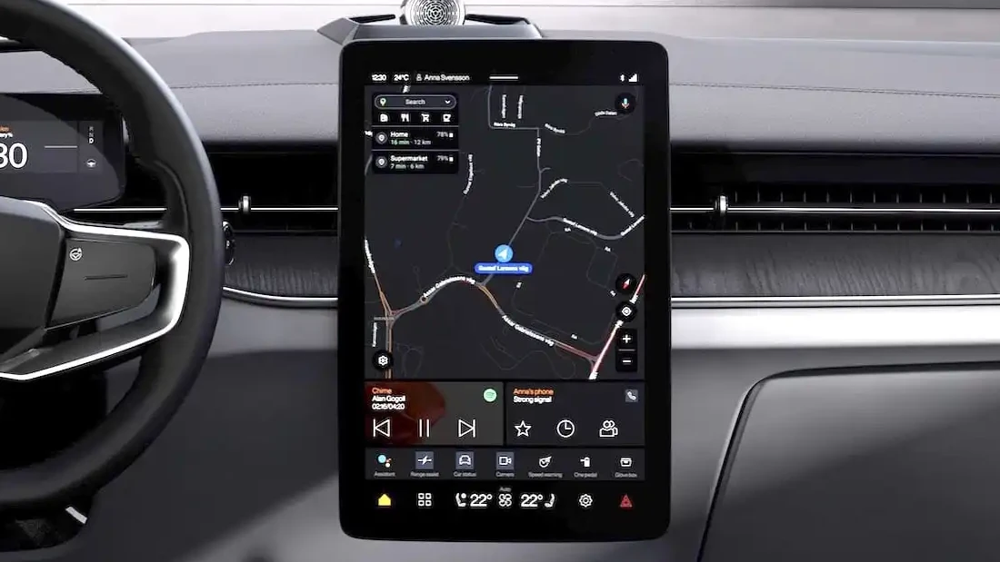
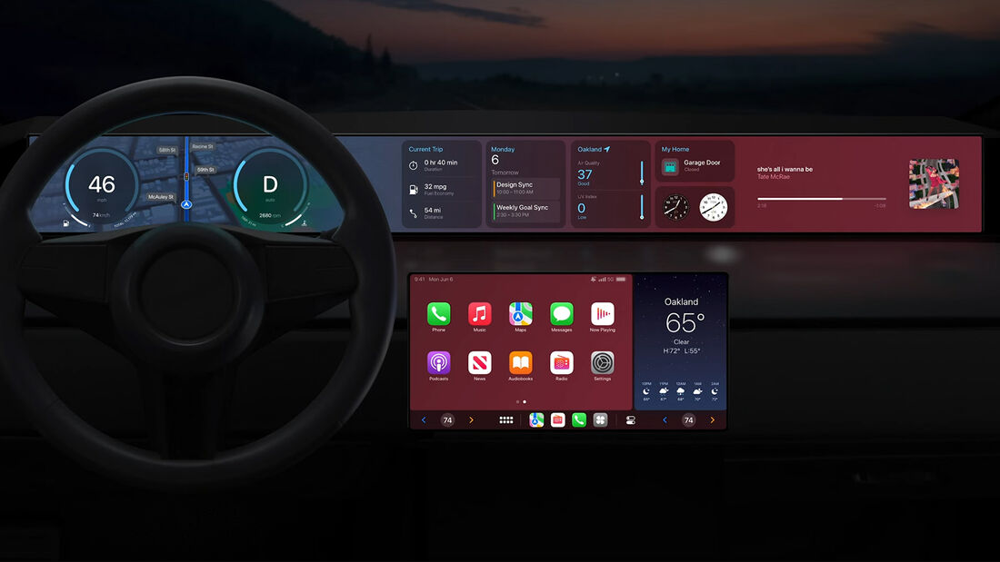

# ReactNativeAutomotiveFramework

Mirroring Android Automotive OS and Apple Car Play in React Native

## Planned Roadmap
- Establishing a Rendering System to Access Android Automotive UI
- Establishing a Data Access Mechanism for Android Automotive
- Establishing a Rendering System to Access Apple CarPlay UI
- Establishing a Data Access Mechanism for Apple CarPlay
